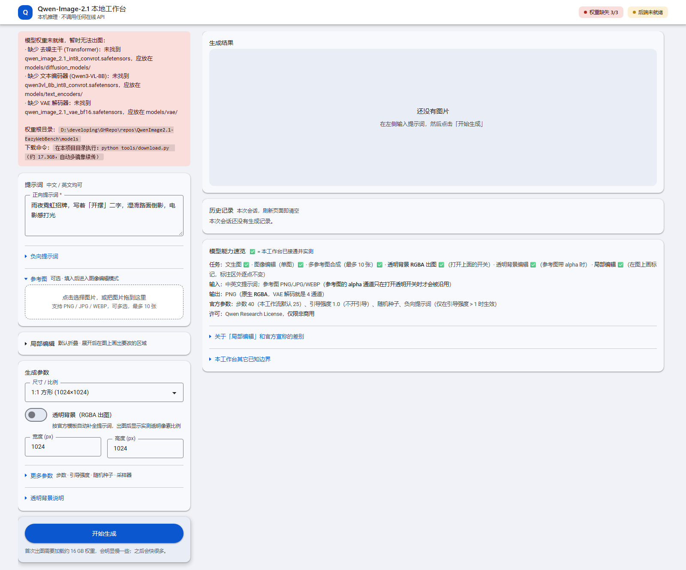
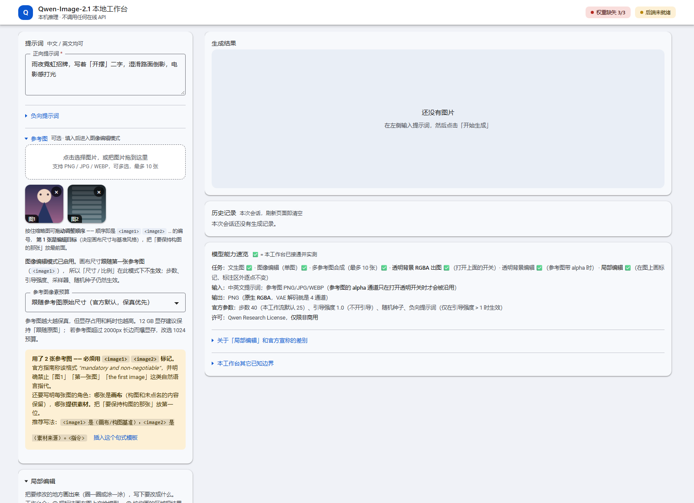
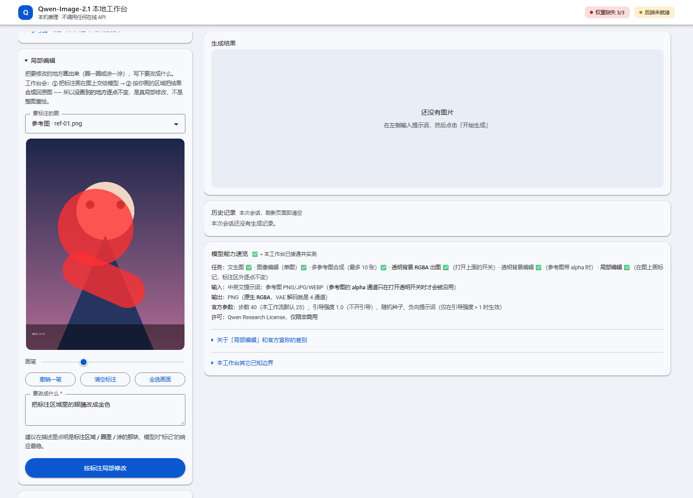

# Qwen-Image-2.1 本地工作台

> **English**: A local web workbench for Qwen-Image-2.1 text-to-image, reference-image editing, transparent-background and annotated local edits, driven through ComfyUI — no online API.


[](requirements.txt)
[](requirements.txt)


浏览器打开就能用的 **Qwen-Image-2.1** 出图工作台。推理全部在你自己的机器上完成，
**不调用任何在线 API**；界面与后端都是本地文件，可离线使用。

**它不是模型本身，也不是 ComfyUI 的替代品** —— 它是 ComfyUI 之上的一层编排：
自动找权重 → 让 ComfyUI 读到权重 → 检测/拉起 ComfyUI → 起一个中文界面。

> [!WARNING]
> **跑起来之前先看这一节。** 这个工作台本体只有约 190 KB（`server.py` + `web/`，整个仓库含文档与诊断脚本约 1.2 MB），但它**不能单独工作**：
>
> | 门槛 | 数值 | 说明 |
> |---|---|---|
> | 模型权重 | **17.3 GB，必须自己下** | 仓库不含权重（`.gitignore` 已忽略），不下载**一张图都出不了** |
> | 显卡 | **NVIDIA，显存 ≥ 12 GB** | 本机实测 1024×1024 峰值占 **11518 / 12227 MB（94%）**，余量只有约 700 MB |
> | ComfyUI | **必须 master 分支** | 参考图编辑依赖 `TextEncodeQwenImage21` 节点，**它不在 v0.30.0~v0.36.0 任何正式 tag 里** |
> | 磁盘 | ≥ 30 GB 可用 | 权重 17.3 GB + 工作余量 |
> | 内存 | 建议 ≥ 32 GB | |
> | 操作系统 | Windows 10/11 64 位 | 启动脚本是 `.bat`；Linux/macOS 可直接 `python server.py`（**未实测**） |
> | Python | 3.10+ | 后端只用标准库，**不需要 pip install 任何东西** |
>
> 缺权重的样子长这样（这是**真实截图**，不是示意图）—— 界面会写明**缺哪个文件、该放哪里、用什么命令下载**：
>
> 
> *工作台首屏（1600×1330 实拍）。红框是 `models/` 为空时的真实提示；顶部两个徽章如实显示「权重缺失 3/3」「后端未就绪」。*

---

<a id="toc"></a>
## 目录

| 想了解 | 看这里 |
|---|---|
| **跑起来需要什么**（权重 17.3 GB / 显存 12 GB / ComfyUI master） | [前置条件](#weights) |
| 五条命令跑起来 | [快速开始](#quickstart) |
| 四种能力分别适合什么场景 | [能力对照表](#capabilities) |
| 文生图 / 参考图编辑 / 透明背景 / 局部编辑怎么用 | [用法要点](#usage) |
| 每个参数是什么意思 | [参数表](#params) |
| 它到底怎么把 ComfyUI 编排起来的 | [工作原理](#how) |
| 凭什么说"这个速度" | [实测性能](#perf) |
| 出问题了怎么看 | [常见问题](#troubleshoot) |
| 有哪些中文文档、坑在哪 | [文档索引](#docs) |
| 哪些平台能跑 | [平台与环境](#platform) |
| 有什么做不到的 | [已知限制](#limits) |
| 想改代码 | [开发](#dev) · [目录结构](#structure) |
| 许可（含模型的非商用限制） | [许可与致谢](#license) |

---

<a id="capabilities"></a>
## 四种能力：先看这张表，再决定用哪个

Qwen-Image-2.1 是**统一「文生图 + 图像编辑」的模型**（视觉主干 7B / 32 层 Single-Stream DiT，
由 Qwen3-VL-8B 负责提示词与参考图的联合编码）。工作台把它的能力收成四个入口：

| 能力 | 你想干什么 | 怎么用 | 实测结果 | 注意 |
|---|---|---|---|---|
| **文生图** | 从一句话出一张图 | 写提示词（中英文都行）→ 选尺寸 → 「开始生成」 | 25 步约 **29–35 秒**（RTX 5070 Ti Laptop 12 GB / int8 / 1024 档） | 官方支持 2K，但本机 12 GB 建议不超过 1024 档 |
| **参考图编辑** | 拿一张图当底子改，或把多张图合成 | 上传参考图（**最多 10 张**）→ 提示词里用 `<image1>` 指代 | 单图约 **47 秒**（短 prompt）/ **85 秒**（长 prompt） | `<image1>` 决定画布与基准风格，**要保持构图的那张放第一位** |
| **透明背景** | 出带 alpha 的 PNG（抠图 / 做素材） | 打开「透明背景（RGBA 出图）」开关 | 1024² 实测透明像素 **70~79%** | 工作台代你补官方模板；但你自己在提示词里写了背景，模型仍会画背景 |
| **局部编辑** | 只改一处，别动其它地方 | 在图上**画标记**（圈 / 涂）→ 写「改成什么」→「按标注局部修改」 | 标注区外变化 **0 / 1001863 = 0.000%** | 标记**区内**的效果取决于模型：换色很稳，要"画出某个图形"可能出伪影，换种子重试 |

**每种能力的适用场景（一句话版）**

- **文生图** —— 你脑子里有画面、手上没有素材。这是唯一不需要任何输入图的路径。
- **参考图编辑** —— 你**已经有一张图**，想改一个属性（发色 / 服装 / 颜色），或者想把几个角色
  放进同一个场景。⚠️ 官方规定：**单图用自然指代**（"图中""这个角色"），**多图必须用
  `<image1>` `<image2>`**（官方称该格式 mandatory and non-negotiable，且明确禁止"图1""第一张图"这种写法）。
- **透明背景** —— 你要的是**素材**而不是成品图：角色立绘、商品图、贴纸。
  也可以用来抠主体：勾透明 + 提示词点名保留什么。
- **局部编辑** —— 整张图基本满意，只有一处不对。它把"改一个细节"从**整图抽卡**变成
  **局部抽卡**：圈外结果稳定可预期，只需在圈内重试。

**已知不支持**（写清楚比藏着强）：ControlNet（官方无 2.1 权重；社区 ControlNet 都属 2512/2509
老架构，不兼容）、经典 img2img 的去噪强度（官方只提供参考图编辑语义，没有 `strength`/`denoise`）、
加速 LoRA（截至 2026-09，2.1 没有任何 Lightning / distill / turbo，必须跑完整步数）。
细节见 [能力清单.md](能力清单.md)。

---

<a id="quickstart"></a>
## 快速开始

<a id="weights"></a>
### 一、前置条件（这一步没法省）

| 项 | 要求 | 说明 |
|---|---|---|
| 操作系统 | Windows 10/11 64 位 | 启动脚本是 `.bat`；Linux/macOS 可直接 `python server.py`（未实测） |
| 显卡 | **NVIDIA，显存 ≥ 12 GB** | 实测 1024×1024 峰值占 11518/12227 MB（**94%**），12 GB 是底线 |
| 内存 | 建议 ≥ 32 GB | |
| 磁盘 | ≥ 30 GB 可用 | 权重 17.3 GB + 工作余量 |
| Python | **3.10+** | 后端只用标准库，**无需 pip 安装任何东西** |
| ComfyUI | **较新版本（master）** | 参考图编辑依赖 `TextEncodeQwenImage21` 节点，**它不在 v0.30.0~v0.36.0 任何正式 tag 里**，必须 master |

> 如果你已有 ComfyUI 在 `127.0.0.1:8188` 运行，可以直接复用，无需配置路径。

### 二、五条命令跑起来

```bat
git clone https://github.com/liceses/QwenImage2.1-EazyWebBench.git && cd QwenImage2.1-EazyWebBench
:: 准备 ComfyUI：下载 ComfyUI_windows_portable_nvidia.7z 解压（https://github.com/comfyanonymous/ComfyUI/releases）
python tools\download.py
启动工作台.bat
python tools\selfcheck.py
```

| 命令 | 它做什么 | 从哪来 |
|---|---|---|
| `git clone` / `cd` | 拿代码、进目录 | 本 README 原命令 |
| ComfyUI 便携版 | 自带匹配的 PyTorch，免装环境 | `分享说明.md` 第 46–49 行 |
| `python tools\download.py` | 下 17.3 GB 权重（多镜像自动切换 + 断点续传 + 按官方字节数校验） | `tools/download.py` |
| `启动工作台.bat` | 查权重 → 让 ComfyUI 读到权重 → 检测/拉起 ComfyUI → 起界面 | `启动工作台.bat` |
| `python tools\selfcheck.py` | 全量自检（权重 / 硬链接 / ComfyUI / 工作台 / 2.1 节点） | `tools/selfcheck.py` |

### 三、每一步的细节

**① 准备 ComfyUI**

推荐**便携版**（自带匹配的 PyTorch）：从 <https://github.com/comfyanonymous/ComfyUI/releases>
下载 `ComfyUI_windows_portable_nvidia.7z`，解压到任意目录。

工作台按以下顺序自动找它，**任选一种**即可：

1. 环境变量 `QWEN21_COMFY_ROOT`
2. 项目根目录下的 `config.json`：
   ```json
   { "comfy_root": "D:\\ComfyUI_windows_portable" }
   ```
   （可复制 `config.example.json` 改名）
3. 常见位置自动探测：项目内 `ComfyUI/`、`~\ComfyUI_windows_portable`、
   `~\Desktop\ComfyUI_windows_portable`、`C:\` `D:\` `E:\` 盘根目录等
4. **ComfyUI 已在 8188 运行** → 直接复用，本步可跳过

> `comfy_root` 指**包含 `ComfyUI/main.py` 的那一层**（便携版形如 `...\ComfyUI_windows_portable`）。

**② 下载权重（约 17.3 GB）**

```bat
python tools\download.py
```

特性：多镜像自动切换（hf-mirror → ModelScope → 官方 HF，实测 **23–30 MB/s**，约 10–20 分钟）、
断点续传、按官方字节数校验完整性。只想下某一个：`python tools\download.py --only vae`

三个文件会放到（脚本自动建目录）：

| 文件 | 大小 | 目录 |
|---|---|---|
| `qwen_image_2.1_int8_convrot.safetensors` | 7.26 GB | `models/diffusion_models/` |
| `qwen3vl_8b_int8_convrot.safetensors` | 9.35 GB | `models/text_encoders/` |
| `qwen_image_2.1_vae_bf16.safetensors` | 0.68 GB | `models/vae/` |

> 用的是 ComfyUI 官方 **int8 量化版**（比 BF16 的 32.44 GB 省一半）。
> **不要重复下载**：ComfyUI 里已有的 `qwen-image-2512-Q4_K_S.gguf`、`qwen_image_vae.safetensors`
> 等**全部不能用于 2.1** —— 架构代际不同（2.1 是 32 层 + Qwen3-VL-**8B** + 64 通道 latent VAE）。

**③ 启动**

双击 **`启动工作台.bat`**（或在该目录执行它）。终端会打印：

```
====================================================================
  工作台已启动，请在浏览器打开:  http://127.0.0.1:8642
  按 Ctrl+C 退出
====================================================================
```

> ⚠️ **别关那个终端窗口**，关了服务就停。

**④ 自检（推荐）**

```bat
python tools\selfcheck.py
```

全部正常会输出 `结果：全部通过，工作台处于可出图状态`；异常会逐项列 `[FAIL]` 并说明原因。

---

<a id="usage"></a>
## 怎么用（要点）

<a id="usage-t2i"></a>
### 文生图

写提示词（中英文都行）→ 选尺寸 → 点「开始生成」。首次出图要加载约 16 GB 权重，会明显慢；
之后单张约 **25–35 秒**（RTX 5070 Ti Laptop 12 GB / int8 / 1024 档 / 25 步）。

**负向提示词默认不生效** —— 官方设计为引导强度 `true_cfg_scale = 1.0`（不开引导）。
要它生效得调到 > 1，代价是每步计算量翻倍。

<a id="usage-edit"></a>
### 参考图编辑

上传参考图后即进入编辑模式。**提示词里用官方标记指代**：

```
把 <image1> 里少女的发色改成粉色，其余一切保持不变。
```


*参考图编辑模式（1600×1400 实拍）。两张参考图带「图1 / 图2」编号徽标与拖拽排序提示，下方是像素预算控件与多图 `<imageN>` 强制提示。图中的两张参考图是 **Pillow 生成的占位示意图**（真出图需要 17.3 GB 权重），界面本身是仓库真实前端代码。*

- **`<image1>` 是编辑目标**，决定画布尺寸与基准风格 —— 把「要保持构图的那张」放第一位
- **顺序可以拖拽调整**：上传后按住缩略图拖动即可重排。顺序即编号，
  拖拽后「图1/图2/图3」会实时重编号，**提交给后端的次序同步跟着变**
- **三种入队方式**（都是追加到队列末尾，不清空已有参考图）：
  1. 点上传区选择文件，或把文件拖进去
  2. 点任意图片介绍处的 **「作为参考图」** —— 把已生成的图直接入队
     （结果区动作行里有；历史记录每张缩略图 hover 也有 `＋`）
  3. 直接 **Ctrl+V** 粘贴剪贴板里的图片（整页有效；粘贴文字不受影响）
- 编辑模式下「尺寸 / 比例」不生效（画布跟随 `<image1>`）
- 单图可用自然指代，**多图必须用 `<imageN>` 标记**（官方称该格式 mandatory）
- **小改动就写小改动**：实测「只把发色改成粉色，其余保持完全一样」→ 只有发色变了，
  姿势/服装/配饰/背景全部原样保留

<a id="usage-alpha"></a>
### 透明背景（RGBA）

打开「透明背景（RGBA 出图）」开关即可 —— 工作台会按官方句式自动补全提示词。
出图后：结果区变**棋盘格**、显示实测透明像素比例、下载按钮变「下载透明 PNG（RGBA）」。
若显示 **0%** 说明这次没生成透明区域，**换个随机种子重试**。

原理：这个模型的 VAE 解码输出**本来就是 4 通道**（`decoder.head.2.weight` 形状 `[4,144,1,3,3]`），
`SaveImage` 一直写着 RGBA PNG —— 所以**通道一直都在**，缺的只是"让模型真的生成透明区域"
的那句官方模板。不写模板时模型给出的是 alpha 恒在 252~255（视觉上全不透明）的图。

参考图自带 alpha 时，输出的 alpha 会**沿用它**，实现「RGBA 进 → RGBA 出」。
判据是"整图里既有透明像素（`min < 250`）也有不透明像素（`opaque_ratio ≥ 0.05`）"，
防止把一张**全透明**的图当成"带 alpha"（那样输出只能是全透明，毫无意义）。

<a id="usage-local"></a>
### 局部编辑

在「局部编辑」卡片里：选图 → 在图上画标记（画笔可调）→ 写「要改成什么」→ 点「按标注局部修改」。


*局部编辑（1600×1400 实拍）。红色笔迹是用真实 pointer 事件在 `#markCanvas` 上画出来的（仓库前端代码自己渲染的），下方是画笔 / 撤销一笔 / 清空标注 / 全选画面与执行按钮。底图是 **Pillow 生成的占位示意图**，非模型产物。*

工作台先让模型按标记重绘，再**按你画的区域把结果合成回原图**，所以**没画到的地方逐点不变**
（实测标注区外 **0 / 1001863 = 0.000%**）。

> 标记区内的效果取决于模型：**换颜色 / 纯色填充很稳**；要求「画出某个特定图形」可能需要换种子重试。
> 局部编辑时**不要勾「自定义画布」**（尺寸必须与基准图一致，否则无法合成）。

<a id="usage-viewer"></a>
### 图片查看

点结果图或历史缩略图的放大按钮：滚轮以光标为中心缩放、拖动平移、1:1 / 适应窗口、下载。

---

<a id="params"></a>
## 参数表

| 参数 | 默认 | 说明 |
|---|---|---|
| 正向提示词 | 空 | 必填。中英文均可。想画面里出现文字，用引号或「」明确写出 |
| 负向提示词 | 空 | **默认完全不生效**（引导强度 1.0 = 不开引导，官方设计）。调到 > 1 才生效，代价是每步算力翻倍 |
| 尺寸 / 比例 | 1:1 (1024×1024) | 官方 7 种比例 + 官方原生 2K 档。**本机建议不超过 1024 档**。⚠️ **编辑模式下此项不生效**（画布跟随 `<image1>`） |
| 采样步数 | 25 | 官方管线默认 40，官方 ComfyUI 工作流默认 25（工作台取后者）。**最直接的调速旋钮**，每步约 1.38 秒 |
| 引导强度 `true_cfg_scale` | 1.0 | 官方明确推荐 1.0（"meant to be sampled without guidance"）。> 1 启用 CFG，**每步计算量翻倍** |
| 随机种子 | 留空 | 留空 = 每次随机；填整数可复现同一张图 |
| 透明背景（RGBA 出图） | 不勾 | 自动补全官方透明模板，并把产物 alpha 实测值报给你 |
| 采样器 / 调度器 | euler / simple | 与官方 Qwen-Image-2.1 工作流一致，一般不要改 |
| 参考图像素预算 | 跟随参考图原始尺寸 | 官方默认（保真最高）。参考图长边超 2000px 且爆显存时改选 1024 预算 |

---

<a id="how"></a>
## 工作原理（一句话：它是 ComfyUI 的一层编排）

```
启动工作台.bat / python server.py
        │
        ├─ ① 查权重      models/ 下三件套在不在、字节数对不对（对不上就报"未下完"）
        ├─ ② 挂权重      extra_model_paths.yaml（零拷贝）→ 不行退硬链接 → 再不行才复制
        ├─ ③ 独占端口探针 不带 SO_REUSEADDR 的 bind；被占就明确报错退出，不静默抢端口
        ├─ ④ 找/拉起 ComfyUI   已在 8188 跑就直接复用
        └─ ⑤ 起界面      127.0.0.1:8642，纯标准库 http.server
```

**权重如何被 ComfyUI 看到**：优先写一份 `extra_model_paths.yaml`（**零拷贝、零额外空间，
跨盘也可用**）；不行才退化为硬链接，再不行才复制（会明确提示要多占 17 GB）。

**为什么后端零依赖**：它复用 ComfyUI 便携版自带的 Python 环境（里面已有匹配的 PyTorch）。
工作台本体只用 Python 标准库。

**前端为什么能离线**：`web/` 是手写 HTML/CSS/JS，Material Design 3 token 手写，
**不引用任何 CDN 或在线字体**。唯一的外部库是 `web/dragula.min.js`
（[Dragula](https://github.com/bevacqua/dragula) 3.7.3，MIT），**随仓库提供**。

---

<a id="perf"></a>
## 实测性能（RTX 5070 Ti Laptop 12 GB / int8 / 1024 档）

| 场景 | 步数 | 耗时 | 显存峰值 |
|---|---|---|---|
| 文生图首次（含权重加载） | 25 | **34.5 s** | 11518 MB |
| 文生图后续 | 25 | **29.3 s** | — |
| 参考图编辑（短 prompt） | 25 | **46.9 s** | — |
| 参考图编辑（长 prompt） | 25 | **85.1 s** | — |
| 三视图 / 多图合成 | 25 | **230–260 s** | — |

每采样步约 **1.38 s**。显存峰值 **11518 / 12227 MB（94%）**，余量仅约 700 MB
→ **出图时请关掉其它占显存的程序**。输出 PNG / RGBA（模型原生支持透明通道）。

> 数据出处：[能力清单.md](能力清单.md) 第 6.2 节与 [使用说明.md](使用说明.md) 第 8 节。

---

<a id="troubleshoot"></a>
## 常见问题

<details>
<summary><b>报「未找到 ComfyUI 安装目录」</b></summary>

按「快速开始 ③」任选一种方式配置 `comfy_root`。注意它指**包含 `ComfyUI/main.py` 的那一层**。
如果 ComfyUI 已经在 8188 跑着，这条可以直接忽略。
</details>

<details>
<summary><b>报「模型权重未就绪」</b></summary>

跑 `python tools\download.py` 补齐。界面顶部会写明**缺哪个文件、该放哪里、大小对不对**。
</details>

<details>
<summary><b>显存不足 / CUDA out of memory</b></summary>

按有效性排序：① **关掉其它占显存的程序**（浏览器硬件加速、游戏、其它 AI 工具）——
这是最有效的一招；② 尺寸降到 896 或 768；③ 步数降到 20 以下；④ **不要用 2048×2048**，按显存推算必 OOM。
</details>

<details>
<summary><b>浏览器显示「无法使用此页面 / 127.0.0.1 未发送任何数据」</b></summary>

这是**同一端口起了两个工作台实例**（Windows 的 `SO_REUSEADDR` 允许两个进程绑同一端口，
内核把连接随机分配）。最常见原因是**启动脚本被双击了两次**。

本机实测：空闲 loopback 端口 `connect()` 会**超时**（不是 connection refused），
所以"连一下看响不响"**区分不了"空闲"和"卡死"** —— 唯一可靠判据是
**不带 `SO_REUSEADDR` 的独占 bind**（被占用时稳定报 `WinError 10048`）。

当前版本已经堵住：启动脚本检测到已有实例就直接打开它，`server.py` 启动前用独占探针
检查端口、被占则明确报错退出（`exit 2`）。

仍然遇到（比如旧版本留下的僵死进程）时，按终端给的命令处理：
```bat
netstat -ano | findstr :8642       rem 看最后一列的 PID
taskkill /PID <那个PID> /F
```
应急可用 `python server.py --force` 强行接管端口。
</details>

<details>
<summary><b>参考图编辑出来跟原图不像 / 用两张参考图结果毫不相干</b></summary>

① 确认提示词里写了 `<image1>`（多图时必须用 `<imageN>`）；
② 确认 ComfyUI 是 **master 分支**（旧版没有 2.1 节点）；
③ 参考图长边别超过 2000px。

> ⛔ **重要更正**：本文档与 `使用说明.md` 早期写过「多参考图不可靠 / 跨风格图对会漂移 /
> 建议退回单图」—— **这些结论全部作废**。它们都是一个 **API 入参格式 Bug** 的假象
> （参考图根本没进模型，所谓"编辑"实际是纯文生图）。已修复并实测，
> 单图编辑 / 三视图 / 两图合成三类任务全部通过。详见 [开发注意.md](开发注意.md) 第 1 节。
</details>

<details>
<summary><b>负向提示词好像没用？</b></summary>

正常的。默认引导强度 1.0 = 不开引导，负向提示词被完全忽略（官方设计）。调到 > 1 才生效。
</details>

<details>
<summary><b>局部编辑为什么不能用"掩码"（比如我把蒙版存成黑白图）？</b></summary>

两个原因：

1. **模型没有掩码入参** —— 官方说的 circles / painted annotations 是**画在条件图上的标记**
   （视觉提示），diffusers 的 `QwenImage21Pipeline` 与 ComfyUI 的 `TextEncodeQwenImage21`
   **都没有 mask 参数**；
2. **潜空间掩码对 2.1 无效** —— 实测 `SetLatentNoiseMask` 被无视：掩码外 **100%** 的像素
   依然被改动（最大通道差 211）。

所以工作台走的是"标记 + 确定性合成"，这也是目前唯一能给出「圈外逐点不变」保证的做法。
</details>

<details>
<summary><b>能像 Qwen-Image-2512 那样 4 步出图吗？</b></summary>

不能。截至 2026-09，**2.1 没有任何加速 LoRA**（Lightning / distill / turbo 搜索均为零结果），
必须跑完整步数。
</details>

<details>
<summary><b>能开高分辨率出 2K 吗？</b></summary>

官方原生支持 2K（如 2752×1536），但**本机 12 GB 显存跑不动**：1024² 就已占 94% 显存。
2K 需要更大显存（保守估计 20 GB 以上）。工作台里保留了 2K 选项，但预计会 OOM。
</details>

<details>
<summary><b>能不能换端口 / 不自动拉起 ComfyUI</b></summary>

```bat
python server.py --port 9000        rem 换端口
python server.py --no-comfy         rem 不自动拉起（自己先启动）
python server.py --force            rem 跳过端口预检（应急）
```
</details>

---

<a id="docs"></a>
## 文档索引（这个仓库的文档比代码长，都是有内容的）

| 想了解 | 看这里 | 里面有什么 |
|---|---|---|
| 模型到底支持什么 | [能力清单.md](能力清单.md) | 16 节调研：支持/不支持的任务、官方 `QwenImage21Pipeline` 参数签名、显存与耗时实测、权重体积、许可证、**第 12 节参考图入参 Bug**、**第 15 节透明通道**、**第 16 节局部编辑** |
| 具体怎么用、出问题怎么办 | [使用说明.md](使用说明.md) | 启动 / 权重 / 界面四节用法 / 参数表 / **Q1~Q14 排障** |
| **提示词怎么写** | [经验总结.md](经验总结.md) | 八步观察者法、微表情纪律、**多图槽位机制**（媒介/风格语义会系统性偏袒 `<image1>` 槽位，4 seed 采样证实）、文字 vs 参考图的条件预算是**零和**、方法学教训（哪些结论只能算"单次观察"） |
| 改代码之前 | [开发注意.md](开发注意.md) | **两个会静默失败的坑**：① ComfyUI Autogrow 入参必须用扁平带点键（写错**不报错**，参考图完全不进模型）② Windows 端口双绑定 |
| 怎么打包分享 | [分享说明.md](分享说明.md) | 分享包含什么/不含什么、ComfyUI 准备、路径配置三法、权重、启动、FAQ |
| 诊断脚本怎么用 | [tools/diag/README.md](tools/diag/README.md) | 31 个脚本的用途，以及**每个脚本的"结论是否可信"** |
| 第三方提示词 skill | [prompt_skills/README.md](prompt_skills/README.md) | 来源、作者、许可，以及与本项目实测的对照（含**两处冲突**的说明） |

### 两个"最值钱"的坑（先看这两个，能省半天）

**① ComfyUI Autogrow 入参必须用扁平带点键**（`开发注意.md` 第 1 节）

```python
# ✅ 正确
"inputs": { ..., "images.image_1": ["10", 0], "images.image_2": ["11", 0] }

# ❌ 错误 —— 被静默忽略，参考图完全不进模型，退化成纯文生图，且不报错
"inputs": { ..., "images": {"image_1": ["10", 0]} }
```

依据：`comfy_api/latest/_io.py` 的 `Autogrow._expand_schema_for_dynamic` 用 `finalize_prefix()`
把子输入展开成 `images.image_N`，且只认 `live_inputs` 里的扁平键。

**一眼判断参考图有没有进去 —— 看输出画布尺寸**（参考图 945×1562 竖版，`resolution=0`）：

| 传参 | 输出画布 | 判定 |
|---|---|---|
| 嵌套 `images={...}` | **1024×1024** 正方形 | ❌ 图没进去 |
| 扁平 `images.image_1` | **960×1568** 竖版 | ✅ 图进去了 |

耗时也差一倍以上（24 s vs 99 s）—— 两个信号互相印证。

**② Windows 端口双绑定**（`开发注意.md` 第 2 节）

`http.server.ThreadingHTTPServer` 的 `allow_reuse_address` 默认为 `True`，而 Windows 的
`SO_REUSEADDR` 语义与 Linux 不同：**它允许第二个 socket 绑到同一个 `host:port` 上，而不是报
EADDRINUSE**。两个实例都在跑时，内核把每个新连接随机分给其中一个 —— 落到卡住的那个，
就是"TCP 连上了但一个字节都没回来"。

### 可复现的证据脚本

文档里的结论不是"我觉得"，每个都有脚本：

```bat
python tools\diag\accept_transparency.py      rem 透明通道验收（真出两张图 + 肉眼对照图）
python tools\diag\accept_local_edit.py        rem 局部编辑验收（标注区外逐点不变）
python tools\diag\diag_autogrow.py            rem 定位 Autogrow 坑的那个实验（唯一可信的多参考图脚本）
python tools\diag\diag_port_semantics.py 18660 rem 端口双绑定语义实测
python tools\diag\cmp_region_diff.py A.png B.png --box=330,230,580,460
python tools\first_run.py                     rem 独立出图实测（记录耗时与显存）
```

> ⚠️ `tools/diag/` 里**大部分脚本用的是错的入参格式**（`tools/diag/README.md` 自己声明了），
> 保留它们是为了留痕，**不是让人照抄**。只有 `diag_autogrow.py` 是可信的定位实验。

---

<a id="platform"></a>
## 平台与环境
| 项 | 事实 |
|---|---|
| 后端 | 纯 Python 标准库，**零第三方依赖**；Python **≥ 3.10**（实测 3.13.14 / 3.14.2） |
| 前端 | 手写 HTML/CSS/JS，Material Design 3 token 手写，跟随系统深浅色，**无 CDN / 无在线字体** |
| 前端唯一外部库 | Dragula 3.7.3（MIT），`web/dragula.min.js`，13953 字节，随仓库提供 |
| 平台分支 | `server.py` 里 `creationflags = 0x08000000 if os.name == "nt" else 0`；启动脚本是 `.bat`；盘符探测硬编码 `C:\` `D:\` `E:\` |
| 实测过的平台 | **只有 Windows 10/11**。Linux/macOS 上 `python server.py` 理论上可用，但**没有实测**，路径探测与端口语义那两块很可能需要调整 |
| 界面语言 | 只有中文 |

---

<a id="structure"></a>
## 目录结构

```
QwenImage2.1-EazyWebBench/
├─ 启动工作台.bat            一键启动（双击）
├─ server.py                 后端（纯 Python 标准库，零第三方依赖）
├─ requirements.txt          依赖说明（其实什么都不用装）
├─ config.example.json       ComfyUI 路径配置模板
├─ web/                      界面（手写 Material Design 3，无 CDN / 无在线字体）
│  ├─ index.html  app.css  app.js  favicon.svg  dragula.min.js
├─ tools/
│  ├─ download.py            权重下载器（多镜像 + 断点续传 + 完整性校验）
│  ├─ selfcheck.py           环境自检：一条命令核验权重/服务/节点
│  ├─ first_run.py           独立出图实测（记录耗时与显存）
│  ├─ speedtest.py           下载源测速
│  ├─ verify_mirror.py       校验镜像权重与官方一致
│  ├─ package.py             打分享包
│  ├─ _paths.py              共享路径解析（环境变量优先，不依赖本机路径）
│  └─ diag/                  诊断与验收脚本（文档里结论的复现脚本）
├─ prompt_skills/            第三方提示词 skill（外部资料，非本项目产物）
├─ docs/screenshots/         README 用图
├─ models/                   ← 权重放这里（需自己下载，17.3 GB）
├─ outputs/                  出图结果（运行期生成）
├─ uploads/                  上传的参考图（运行期生成）
├─ 能力清单.md                模型能力调研 + 关键坑与实测结论
├─ 使用说明.md                详细使用说明
├─ 经验总结.md                提示词工程实测经验
├─ 开发注意.md                改代码前必读的两个坑
└─ 分享说明.md                分发说明
```

> 仓库**不含**模型权重、出图结果与其它任务的产物（见 `.gitignore`）。
> 文档里提到的 `示例效果/`、`修复验证/` 目录**也不在仓库里** ——
> 里面的对照图由 `tools/diag/` 的验收脚本在你机器上重新生成。

---

<a id="limits"></a>
## 已知限制

1. **一次只能跑一个出图任务**（并发提交返回"已有出图任务正在进行中"）。这是刻意的，
   避免 12 GB 显存被抢爆。
2. **历史记录不持久化**，刷新页面即清空。
3. **不支持 ControlNet**（老架构的 ControlNet 不兼容 2.1）。
4. **不支持经典 img2img 的"去噪强度"调节**：官方只提供参考图编辑语义，没有 `strength`/`denoise` 参数。
5. **不支持加速 LoRA**：截至 2026-09，2.1 没有任何 Lightning / distill / turbo。
6. **局部编辑是"标记 + 合成"，不是掩码 API**：标记区内的质量仍取决于模型，
   复杂要求可能要换种子重试。
7. **透明背景必须写清"要透明"**：工作台会代你补官方模板；但如果你**自己**在提示词里
   描述了"带背景"的画面，模型仍会按你说的画出不透明背景 —— 勾开关不等于强制透明。
8. **多主体画面里的白色中文叠加文字容易乱码**（模型对画面内文字的弱项，与参考图无关）。
9. **参考图上限 10 张**，同一张图重复加入**不会去重**。
10. **12 GB 显存是硬底线**：1024² 已占 94%，余量约 700 MB。
11. 若 ComfyUI 升级后 2.1 节点有变动，可能需要同步调整 `server.py` 的 `build_workflow()`。
12. **平台**：只在 Windows 上实测过。

---

<a id="dev"></a>
## 给要改这个项目的人

**改之前先读 [开发注意.md](开发注意.md)** —— 那里记录了**两个会静默失败的坑**：
Autogrow 入参格式（不报错，参考图根本不进模型）与 Windows 端口双绑定（页面随机打不开）。

**改界面的铁律**：改 `web/index.html` 前后用脚本对账 `app.js` 里所有 `$("id")` 引用
（上一次改版核对了 48 个 id 全命中），否则动态注入的元素会静默退化成裸控件。
诊断脚本见 `tools/diag/`，[tools/diag/README.md](tools/diag/README.md) 里标明了
**哪些脚本的结论不可信**。

**这个仓库的文档纪律**：`经验总结.md` 把结论按证据强度分三级
（单次观察 / 同 seed 受控 / 多 seed 采样），并把**待验证项**单列一节（含一个跑了一半的槽位对调实验）。
改文档时请保持这个习惯。

---

<a id="license"></a>
## 许可与致谢

### 本仓库自身的许可

**仓库根目录没有 `LICENSE` 文件**，`package.json` 之类清单文件也不存在 ——
即**本仓库的代码尚未声明许可**。这不是本次改动能决定的，需要仓库主人确认版权署名后添加。

### 模型与权重的许可（⚠️ 这条更要紧）

**Qwen-Image-2.1 使用 Qwen Research License，仅限非商用**（`license_name: qwen-research`）。
官方原文第 2 条：grant 为 *"FOR NON-COMMERCIAL PURPOSES ONLY"*；第 1.i 条把 `Non-Commercial`
定义为 *"for research or evaluation purposes only"*。**商用需单独向官方申请**
（`model-business@notice.qwencloud.com`）。

**如果你的产物要商用，2.1 不是合适选择** —— 同系列老一代（`Qwen-Image`、`Qwen-Image-Edit-2509`、
`Qwen-Image-2512`、`Qwen-Image-Layered`）均为 **Apache-2.0**，可商用。

### 引用的第三方

| 项目 | 许可 | 说明 |
|---|---|---|
| [Qwen-Image-2.1](https://github.com/QwenLM/Qwen-Image-2.1) | Qwen Research License | 模型本体，仅限非商用 |
| [Comfy-Org/Qwen-Image-2.1](https://huggingface.co/Comfy-Org/Qwen-Image-2.1) | 同上 | int8 量化权重（本工作台采用，17.29 GB） |
| [ComfyUI](https://github.com/comfyanonymous/ComfyUI) | GPL-3.0 | 推理后端，需 master 分支 |
| [Comfy-Org/workflow_templates](https://github.com/Comfy-Org/workflow_templates) | — | 官方工作流参考（参数默认值的来源） |
| [Dragula](https://github.com/bevacqua/dragula) v3.7.3 | MIT | 参考图拖拽排序。为保持"离线可用"，库文件**随仓库提供**（`web/dragula.min.js`），不引 CDN |
| `prompt_skills/qwen-image-2.1-role-asset` | **CC-BY-NC-4.0** | 第三方提示词 skill；作者 GAINAIhub；用其提示词产出的图**仅限个人学习自用** |
| `prompt_skills/bozo-qwen21-prompt` | **包内未声明** | 第三方提示词 skill；作者 bozoyanhub；⚠️ 再分发存在法律模糊地带 |

> 两个第三方 skill 包的下载量与采用度都很低（24 / 10 次），**未经大规模验证**，当参考而非权威。
> 详见 [prompt_skills/README.md](prompt_skills/README.md)。

本仓库是围绕上述开源项目做的**本地工作台封装**（后端 + 界面 + 工具链），不含模型本身。
